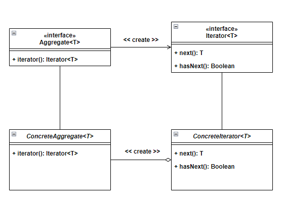

# Iterator Pattern

Iterator(반복자) 패턴은 **객체의 집합체를 순회**하면서 요소에 접근하는 방법을 제공하는 디자인 패턴 중 하나 입니다.

 

## 주요 구성 요소

### Iterator
- ConcreteIterator 요소를 순회하면서 접근하는 인터페이스를 정의합니다.
  - `next()` : 다음 요소에 접근하기 위한 메서드
  - `hasNext()` : 현재 위치가 유효한지 확인하는 메서드

### ConcreteIterator
- Iterator 인터페이스를 구현하며, 실제로 반복을 수행하는 클래스입니다.
- 컬렉션의 내부 구조에 따라 반복을 처리하고, 각 요소에 접근합니다.

### Aggregate
- 객체들의 집합을 나타내는 인터페이스를 정의합니다.
- 이 집합체는 반복자를 생성하는 `createIterator()` 메서드를 포함합니다.

### ConcreteAggregate
- Aggregate 인터페이스를 구현하며, 실제로 객체들의 집합을 관리하는 클래스입니다.
- 반복자를 생성하여 반환하는 `createIterator()` 메서드를 구현합니다.

 

## Iterator Pattern 특징
### 장점
- 컬렉션의 내부 구조를 감추고, 외부에서는 요소에 접근하는 인터페이스만을 제공합니다.
- 반복자를 통해 순회 방식을 변경하거나 다양한 방식으로 요소에 접근할 수 있습니다.
- 컬렉션의 구현과 반복 로직을 분리하여 각각의 역할에 집중할 수 있게 합니다.

### 단점
- 클래스가 늘어나며, 복잡도가 증가합니다.
